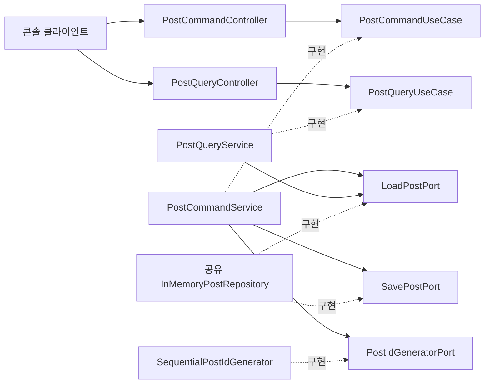

# 아키텍처와 설계 이유

이 문서는 현재 구현의 역할, 의존성 방향, 데이터 흐름과 설계 선택 이유를 설명합니다.
과제 요구사항과 구현 위치, 실행·검증 방법은 [과제 요구사항 체크리스트](assignment-checklist.md)를 참고하세요.

콘솔 클라이언트와 서버는 같은 JVM에서 실행하며, 클라이언트가 서버 컨트롤러를 직접 호출합니다.
이 과제의 서버·클라이언트 분리는 역할과 코드 의존성의 분리이며 실제 네트워크 통신은 아닙니다.

## 패키지 구조

```text
org.sopt
├── Main
├── client/console
│   ├── PostConsoleClient
│   ├── PostInput
│   ├── PostView
│   └── ConsoleInputClosedException
├── global
│   ├── response/BaseResponse
│   └── exception
│       ├── ErrorCode
│       ├── BaseException
│       ├── GlobalErrorCode
│       └── GlobalExceptionHandler
└── post
    ├── config/PostServerConfiguration
    ├── domain
    │   ├── Post
    │   ├── Category
    │   └── exception
    │       ├── PostException
    │       └── PostErrorCode
    ├── application
    │   ├── port/in
    │   │   ├── command/PostCommandUseCase
    │   │   └── query/PostQueryUseCase
    │   ├── port/out
    │   │   ├── LoadPostPort
    │   │   ├── SavePostPort
    │   │   └── PostIdGeneratorPort
    │   └── service
    │       ├── command/PostCommandService
    │       └── query/PostQueryService
    └── adapter
        ├── in/api
        │   ├── PostCommandController
        │   ├── PostQueryController
        │   └── dto
        │       ├── PostCategory
        │       ├── request
        │       │   ├── CreatePostRequest
        │       │   └── UpdatePostRequest
        │       └── response/PostResponse
        └── out
            ├── persistence/InMemoryPostRepository
            └── id/SequentialPostIdGenerator
```

## 역할과 데이터 흐름

| 구성 요소 | 책임 |
| --- | --- |
| `Main` | 서버 구성 팩토리 호출과 콘솔 클라이언트 시작 |
| `PostConsoleClient` | 메뉴 반복, 요청 DTO 구성, 공통 응답 처리 |
| `PostInput` | 입력·숫자 변환·카테고리 선택 및 재입력 |
| `PostView` | 주입받은 PrintStream으로 메뉴·게시글·메시지 출력 |
| `PostCommandController` | 생성·수정·삭제 요청 확인, DTO 변환, Command 호출과 공통 응답 |
| `PostQueryController` | 조회 요청 전달, 결과 DTO 변환과 공통 응답 |
| `GlobalExceptionHandler` | 서버 작업의 성공·실패를 BaseResponse로 변환 |
| `PostCommandUseCase` / `PostCommandService` | 게시글 상태 변경의 계약과 처리 흐름 |
| `PostQueryUseCase` / `PostQueryService` | 게시글 조회의 계약과 처리 흐름 |
| `Post` | 불변 게시글 상태와 생성·수정 검증 |
| `LoadPostPort` | 저장소 조회 계약 |
| `SavePostPort` | 저장소 생성·교체·삭제 계약 |
| `InMemoryPostRepository` | HashMap 관리 |
| `PostIdGeneratorPort` / `SequentialPostIdGenerator` | ID 발급 계약과 구현 |
| `PostServerConfiguration` | 서버 객체의 생성과 의존성 연결 |



클라이언트는 서버 도메인, 유스케이스, 저장소를 직접 사용하지 않습니다.
서버는 콘솔 입력·출력 객체를 참조하지 않습니다.
Main의 서버 구성 팩토리 호출은 같은 프로세스에서 두 역할을 실행하기 위한 연결입니다.
PostServerConfiguration.createControllers()는 공유 저장소에 연결된 두 컨트롤러를 한 번에 생성합니다.
Controllers record는 객체 조립 결과를 묶는 값이며, 게시글 API를 다시 합치는 중간 계층은 아닙니다.
Main은 이 쌍을 풀어 콘솔에 두 컨트롤러를 각각 주입합니다.

Request·Response DTO는 서버 입력 어댑터 아래에 있습니다. 유스케이스에는 개별 인자를
전달하므로 서버 application 계층은 전송 DTO를 알지 못합니다.
`PostResponse`는 record 스냅샷이고 결과 목록은 수정할 수 없습니다.
클라이언트가 이전 결과를 보관해도 이후 서버 수정·삭제로 바뀌지 않습니다.
게시글 응답 변환은 `PostResponse.from(Post)`에, 카테고리 변환은
`PostCategory.toDomain()`과 `PostCategory.from(Category)`에 둡니다.
컨트롤러는 이 메서드를 호출하며, 두 Enum의 대응 관계는 명시적인 switch로 정의합니다.

## 공통 응답과 전역 예외 처리

Command·Query 컨트롤러의 모든 기능 메서드는 `BaseResponse<T>`를 반환합니다.

| 필드 | 의미 |
| --- | --- |
| `success` | 처리 성공 여부 |
| `code` | 성공 시 SUCCESS, 실패 시 오류 코드 |
| `message` | 사용자 안내 |
| `data` | 조회 결과. 실패 또는 생성·수정·삭제 응답에서는 null |

BaseResponse 생성자는 코드가 null 또는 공백인 응답을 거부합니다.
성공 응답은 SUCCESS 코드, 실패 응답은 그 외의 코드만 허용하며 실패 데이터는 null이어야 합니다.
생성·수정·삭제의 성공 응답은 데이터가 없어도 유효합니다.

예를 들어 없는 게시글을 조회하면 다음 값을 받습니다.

```text
success = false
code = POST_NOT_FOUND
message = 존재하지 않는 게시글입니다.
data = null
```

`PostException`은 공통 `BaseException`을 상속하고, `PostErrorCode`는 `ErrorCode`를 구현합니다.
서비스와 도메인은 예외를 발생시키며 서버 컨트롤러 경계에서 `GlobalExceptionHandler`가
실패 응답으로 변환합니다. 클라이언트는 서버 예외를 직접 catch하지 않고 응답을 표시합니다.
콘솔 입력 종료는 클라이언트 전용 ConsoleInputClosedException으로 구분해 정상 종료합니다.
작성·수정 입력 도중 EOF가 발생하면 미완성 요청은 서버로 보내지 않습니다.
현재 전역 핸들러는 서버 메서드가 사용하는 실행 래퍼이며 Spring의 자동 예외 처리 기능은 아닙니다.

| 오류 코드 | 의미 |
| --- | --- |
| POST_NOT_FOUND | 조회·수정·삭제 대상이 없음 |
| INVALID_TITLE | 생성·수정 제목이 null 또는 공백뿐임 |
| INVALID_CONTENT | 생성·수정 본문이 null 또는 공백뿐임 |
| INVALID_CATEGORY | 생성 카테고리가 null임 |
| INVALID_AUTHOR | 생성 작성자가 null 또는 공백뿐임 |
| INVALID_REQUEST | 요청 객체가 null임 |
| INTERNAL_SERVER_ERROR | 예상하지 못한 서버 실행 오류 |

예상하지 못한 RuntimeException은 서버 Logger에 기록하고 일반 오류 메시지만 응답합니다.
Error는 잡지 않습니다. 빈 목록은 정상 상태이며 번호 입력 없이 안내하는 기존 콘솔 흐름을 유지합니다.
없는 수정 ID는 새 제목·본문을 입력받기 전에 확인합니다.

## 게시글 정보와 저장소

제목·본문·작성자는 생성 시 null, 빈 문자열, 공백뿐인 값을 거부합니다.
`isBlank()`로 탭·줄바꿈 등도 검사하며 유효한 텍스트의 앞뒤 공백은 유지합니다.
`Post`는 모든 필드가 final인 불변 객체입니다. `update(title, content)`는 같은 제목·본문
검증을 적용한 새 객체를 반환하며 원본은 변경하지 않습니다. 서비스가 반환된 객체를
저장소에 반영하므로, 조회한 객체로 update를 호출하는 것만으로 저장소가 바뀌지 않습니다.
검증 실패 시 저장소는 그대로 유지되고, 이전에 조회한 객체도 이후 수정의 영향을 받지 않습니다.

카테고리는 GENERAL(일반), QUESTION(질문), INFORMATION(정보) 중 필수 선택입니다.
작성 시각은 생성자에서 LocalDateTime.now()로 기록하며 실행 환경의 로컬 시간을 사용합니다.
카테고리·작성자·작성 시각은 제목·본문 수정 후에도 유지됩니다.

작성 입력 순서는 제목 → 본문 → 카테고리 번호 → 작성자입니다.
목록에는 ID·카테고리·작성자를 표시하고 상세에는 작성 시각도 표시합니다.
조회·수정·삭제에는 목록 위치가 아닌 실제 long ID를 입력합니다.

`HashMap<Long, Post>`로 ID 조회·수정·삭제를 평균 O(1)에 수행합니다.
목록은 복사 후 ID 오름차순으로 정렬하므로 O(n log n)입니다.
`hasPosts()`는 저장소 isEmpty()를 사용해 전체 목록 정렬을 피합니다.
ID 1, 2, 3 중 2를 삭제하면 1, 3이 남고 다음 발급 ID는 4입니다.
생성 검증 실패에도 발급된 ID는 소비될 수 있습니다. 중복 저장은 기존 글을 덮어쓰지 않고 거부합니다.
메모리 저장소와 순차 ID 생성기는 단일 스레드 콘솔 실행용이며 재시작하면 초기화됩니다.

## 헥사고날 아키텍처를 선택한 이유

게시글 규칙과 처리 흐름을 콘솔 입출력 및 저장 방식에서 분리하기 위해 헥사고날 아키텍처를 적용했습니다.
도메인은 게시글의 유효한 상태를 관리하고, 애플리케이션은 필요한 기능을 포트로 정의합니다.
어댑터는 그 포트를 외부 요청이나 실제 저장 방식과 연결합니다.

| 용어 | 현재 코드에서의 의미 |
| --- | --- |
| domain | 게시글 상태와 유효성 규칙 |
| application | 게시글 기능의 계약과 처리 흐름 |
| port | 애플리케이션을 호출하거나 애플리케이션이 다른 기능을 호출하기 위한 인터페이스 |
| adapter | 외부 요청을 입력 포트에 연결하거나 출력 포트를 실제 기능으로 구현하는 클래스 |
| in | 외부에서 애플리케이션 기능을 호출하는 방향 |
| out | 애플리케이션에서 저장소·ID 발급 등의 기능을 호출하는 방향 |

in·out은 요청 데이터와 응답 데이터가 이동하는 방향을 뜻하지 않습니다.
PostCommandController는 PostCommandUseCase를, PostQueryController는 PostQueryUseCase를 호출합니다.
PostCommandService는 LoadPostPort·SavePostPort·PostIdGeneratorPort를 사용하고,
PostQueryService는 LoadPostPort만 사용합니다.
저장소와 ID 발급 어댑터가 애플리케이션에 정의된 출력 포트를 구현하므로 서비스는 구체 구현에 의존하지 않습니다.
PostServerConfiguration에서 구현체를 생성해 생성자로 주입합니다.

## 설계 선택과 변경 범위

### Command와 Query를 분리한 이유

기존에는 하나의 PostUseCase·PostService·PostController가 조회와 상태 변경을 모두 담당했습니다.
규모가 커지면 변경에는 권한·검증·트랜잭션 요구가, 조회에는 검색·필터·정렬·페이지네이션 요구가 늘어납니다.
이번에는 이 두 책임이 독립적으로 확장되는 구조를 학습하기 위해 호출 계약부터 분리했습니다.

| 구분 | Command | Query |
| --- | --- | --- |
| 목적 | 게시글 상태 변경 | 상태를 변경하지 않고 정보 조회 |
| 기능 | createPost, updatePost, deletePost | getPosts, getPost, hasPosts |
| 입력 포트 | PostCommandUseCase | PostQueryUseCase |
| 서비스 | PostCommandService | PostQueryService |
| 컨트롤러 | PostCommandController | PostQueryController |
| 저장소 접근 | LoadPostPort + SavePostPort | LoadPostPort |
| ID 발급 | 사용 | 사용하지 않음 |

**얻는 효과:** 조회 서비스는 조회 계약만 주입받으므로 그 의존성을 통해 저장·수정·삭제를 호출할 수 없습니다.
조회와 변경의 메서드 및 의존성이 구분되어, 기능 추가와 리뷰에서 어느 흐름을 바꾸는지 더 명확해집니다.
테스트도 각 흐름을 구분해 구성할 수 있습니다. 두 흐름의 상호 작용은 같은 저장소를 사용하는 통합 시나리오로 검증합니다.

Command도 조회할 수 있습니다. updatePost는 저장된 게시글을 읽고 검증한 새 Post로 교체해야 합니다.
그 조회는 변경 작업의 내부 단계이므로 Query 서비스를 호출하지 않고 LoadPostPort를 사용합니다.
이는 조회 API가 변경 책임을 갖는 것과 다릅니다.

**비용과 적용 범위:** 클래스와 인터페이스가 늘어나 단순 CRUD에서는 탐색할 파일이 많아집니다.
현재는 학습 목적의 기본 Command/Query 분리이며, 입력 포트는 각 하나로 묶고 기존 DTO·개별 인자를 유지합니다.
기능별 UseCase와 내부 Command·Info DTO는 추가하지 않습니다.

Load/Save 계약을 분리해도 메모리 저장소는 하나의 HashMap을 공유합니다. Command의 결과는 Query에서 즉시 조회됩니다.
조회용 DB·변경용 DB, 별도 조회 모델, 이벤트 동기화는 도입하지 않았습니다.
현재는 Spring을 사용하지 않으므로 트랜잭션이나 readOnly 설정도 없습니다.


### 불변 게시글

저장소가 변경 가능한 Post를 공유하면 조회한 객체를 수정하는 것만으로 저장소의 값이 바뀔 수 있습니다.
이를 막기 위해 Post를 불변 객체로 두고, update는 검증한 새 객체를 반환하도록 했습니다.
PostCommandService가 그 객체를 저장소에 반영하며, 이전 객체와 조회 결과는 유지됩니다.
수정마다 객체를 생성하지만 저장소에서는 같은 ID의 값을 교체하므로 게시글 수가 늘어나지는 않습니다.

### DTO 안의 변환 메서드

변환 규칙을 결과 타입과 함께 볼 수 있도록 PostResponse.from(Post)와 PostCategory의 변환 메서드를 사용합니다.
입력 어댑터의 DTO가 도메인을 참조하는 방향은 허용하며, 도메인과 애플리케이션은 외부 DTO를 참조하지 않습니다.
요청은 현재 유스케이스의 개별 인자로 전달하므로 별도의 Command·Info나 Mapper는 도입하지 않았습니다.

### 두 카테고리 Enum

Category는 도메인의 분류이고 PostCategory는 외부 요청·응답에서 사용하는 분류입니다.
이 분리는 외부 형식을 도메인에 직접 묶지 않기 위한 선택이며, 두 Enum을 동기화해야 하는 비용도 있습니다.
명시적인 switch로 대응 관계를 표현하고, 값이 추가되면 누락된 매핑을 컴파일 단계에서 확인합니다.
도메인의 한글 명칭은 분류의 의미를 설명하기 위해 유지합니다.

### 조회 결과와 목록 계약

LoadPostPort.findAll은 ID 오름차순의 독립된 목록 스냅샷을 반환합니다.
반환 목록의 수정 가능 여부는 포트 계약에서 보장하지 않지만, 목록 변경은 저장소에 반영되지 않습니다.
현재 저장소는 수정 가능한 복사본을 반환하고 서버 컨트롤러는 수정 불가능한 DTO 목록을 반환합니다.
단건 콘솔 조회는 대상 선택에서 받은 PostResponse를 재사용해 같은 게시글을 다시 요청하지 않습니다.
수정·삭제 전 대상 확인은 존재하지 않는 게시글에 대해 추가 입력을 받지 않는 콘솔 흐름을 유지하기 위한 선택입니다.

### 시간과 실행 환경

작성 시각은 Post 생성자가 LocalDateTime.now()로 기록합니다. 수정 객체에서는 원래 시각을 유지합니다.
Clock 주입은 현재 적용하지 않아 작성 시각 테스트는 실제 시스템 시간을 사용합니다.
메모리 저장소와 순차 ID 발급은 단일 스레드 실행을 전제로 하며 영속 저장이나 동시 요청 처리는 제공하지 않습니다.

### HTTP 서버로 전환할 때

웹·앱 클라이언트를 도입하면 콘솔 클라이언트를 대체하고 HTTP 요청을 받는 입력 어댑터를 연결할 수 있습니다.
현재 게시글 규칙과 유스케이스를 재사용할 수 있지만, 라우팅·직렬화·HTTP 상태 코드·프레임워크 예외 처리 연결은
추가 구현이 필요합니다. 동시 요청이나 데이터베이스를 도입할 때는 저장소·ID 발급·트랜잭션도 함께 검토해야 합니다.
